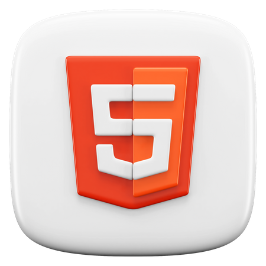
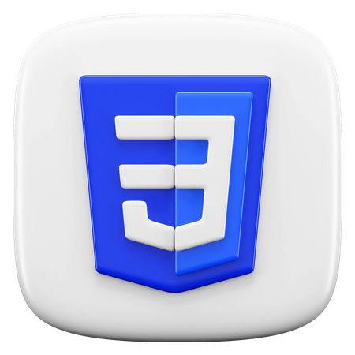

<h1 align="center">Documentação do projeto</h1>

<p align="center">
  Nesse projeto exploremos os displays flex e grid, além de colocar em prática todos os outros ensinamentos passados nas aulas anteriores<br/>
</p>

## 🚀 Tecnologias

Esse projeto foi desenvolvido com as seguintes tecnologias:




## ⚙️ Instalação do projeto

Passo-a-passo:

1. Clonar o repositório do git:
   > Para isso, basta pegar o link do repo e colocar git clone atras, segue o exmplo:

```
git clone https://github.com/wesleysousaa/vs13-front-01-html-css-task-04.git
```

## 👥 Equipe

- José Welton
- Wesley Alencar Souza

## 💻 Sobre o Projeto

Como já mencionei anteriormente, Nesse projeto exploremos os displays flex e grid, além de colocar em prática todos os outros ensinamentos passados nas aulas anteriores.
